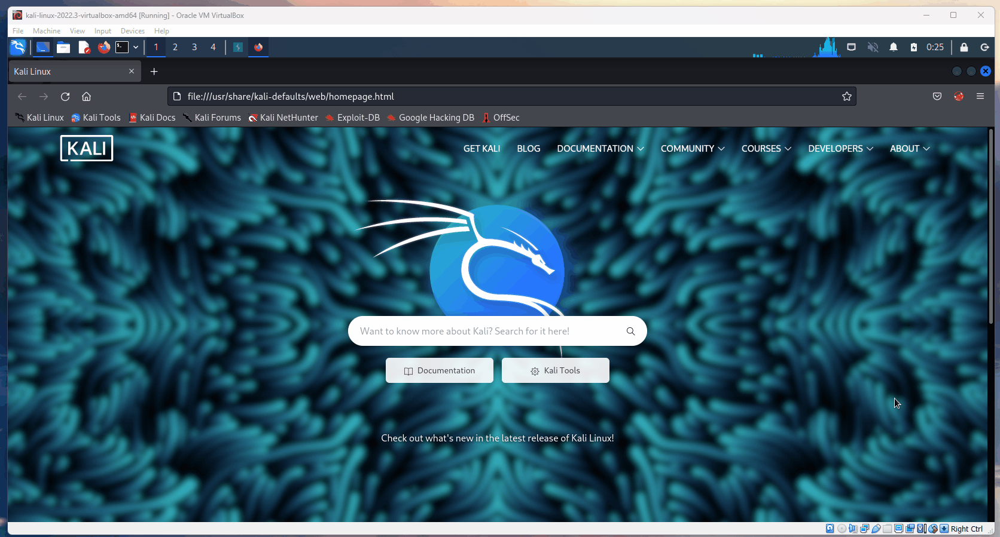
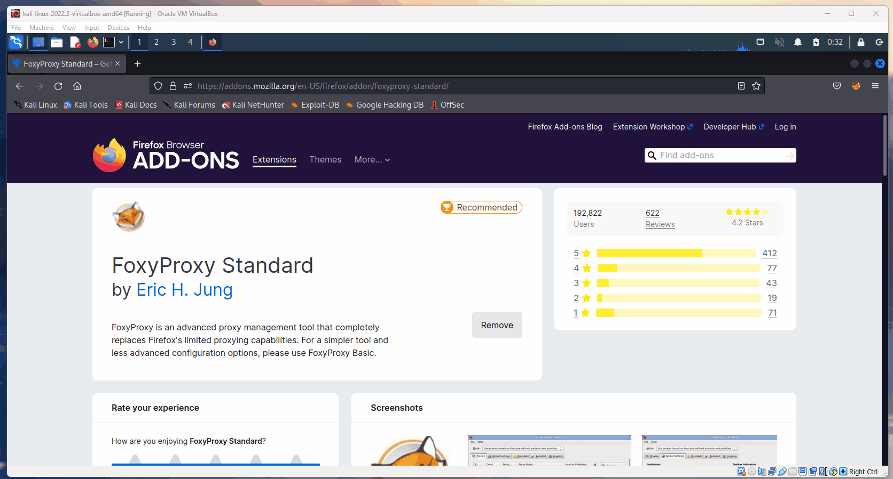

# Welcome
Installing kali and setting up BurpSuite

## Installing a VM

To install kali you'll first need a VM. I recommend for a first time VM is using Virtual box. This app is free and just like VMware easy to use. The link below will take you to the site.

 - https://www.virtualbox.org/wiki/Downloads
 
 
 
 Once you have downloaded the lastest version of Virtualbox make sure to run it just in case that it runs correctly. Next Install the extension pack for ` all platforms ` . Once installed run that also and it should automatically install itself to Virtual Box.
 
 

 ## Installing Kali
 
 Now that you have your VM installed next will be installing Kali Linux. This flavor of linux is used for Cyber Security and there is other flavors like Parrot Secuirty, RedHat, etc.. etc.. The link below will lead you to the offical Kali website. However, before we download anything go to the Microsoft store and search for 7zip manager unoffical, this will be needed to extract Kali for installment. From here we will install the 7zip file which has the most current version of Kali for Virtual Box. Once that is installed into your machine, extract the file using 7zip.
 
 
 

 - When extracting this be sure to extract it somewhere easy to find, or not you will be looking all over tying to find it.
 * Unfortunately I wasn't able to record the extraction, but just use your imagination. :)
 
  - https://www.kali.org/get-kali/#kali-virtual-machines
 
 Once extracted go to the file and click on the vdi file to open it ( the one with the blue box). Doing this automatically opens up Virtual Box and installs Kali already preconfigured. Once it is installed run Kali to make sure it runs properly. 
 
 
 
 On the laucher which is Virtual Box  turn off the machine or save the state if not already. Go into the machine settings, on the advance settings under the General tab make sure that the clipboard and Drag 'n' Drop are set to Bidirectional. This means you can transfer whatever from your host machine to the guest machine. 
 
 
 
 # WARNING!!!!!!!!!!!!!!!
 
 The software you going to install is an actual OS used for hacking. Im assuming everyone here is a whitehat hacker, so if you every plan to use this outside of a testing environment there will be repercussions. Hopefully I didnt turn you into a super villan or introduce you to your villan arc. 

# YOU BEEN WARN!!!!!!!!!!!!!!

## Burp Suite

* BTW the user and pass is kali, it shows on the discription located in the launcher.

Kali come preinstalled with a vast variety of tools at your disposal. One of those key tools is BurpSuite. This tool is a hackers bestfriend. This tool is used for performing secuirty testing for web applications. Throughout our lessons we will be using this tool to do various things.

## Configuration

Now that you have the VM setup we start on configuration. In teams I inlcuded the CA Cert for burp suite using firefox. Drag and drop that file into Kali. Next in firefox you want to install a add-on called foxy proxy. This will be used as a listener for the browser and BurpSuite to talk with each other.

Once that is installed, click on the options button to add a our new proxy. Once you are in the settings of foxy proxy there will be nothing on it yet. Click on ` add ` and this is where the magic happens. Now on the top left click on the Kali dragon icon. In the search bar type burpsuite. Once the application shows in your search run burpsuite. Click next all the way. Now I'm assuming you are looking at the dashboard of burp, pretty cool huh? Ok focus, so in the Proxy tab there is a selection called "Options". Once you make your way to the options in the proxy tab of burp, there right in front of you is the IP address and port number, ` 127.0.0.1:8080 `. Add that into foxy proxy. Congrats you just set up your first proxy.

Now that the easy part is done, time for the next easy part which is adding that CA Cert to your browser; without this cert running the listener is kinda pointless. 

### PSA
Hey so I failed to realize that the cert on teams wont work as a CA in kali but it's ok cause I fixed it.

OK at this point your firefox browser should be configured with the proxy. While running burp in the URL address bar of firefox type ` http://burpsuite `, type it just like that. It will redirect you to the a page that has the CA Cert. On the top right click the CA Certification which will automatically download the file. You will get prompted asking how to you want to store it and such, just click save. 

From here go back to Firefox, on the top right click the menu ( the three lines), then settings. On the search bar type Cert which will pull up Certificates for Firefox. Choose ` View Certificates`. Lastly import the CA Cert which is located in the download directory by default. If you want to know whether or not the import was successful go back to view all the certificates and scroll down until you see portswigger CA. 

## Finale

Congrats ladies and gents you sucessfully installed a virtual machine, linux os, and configured a listener between a tool and browser. From this point forward you are now hackers in training. A wise old man once told me " With great power, comes great responsibility", so tread lightly because this one tool is pretty powerful if you know what your doing. Other than that mess aroung with it, become familar with it. I recommend logging into try hack me and view the lessons for burpsuite. Portswigger also has a free academy specific for Burp, so go ahead and check that out too. 

If you got any questions feel free to reach me or Dr. Al-Omari for any help. 

# See yall next time, stay groovy
